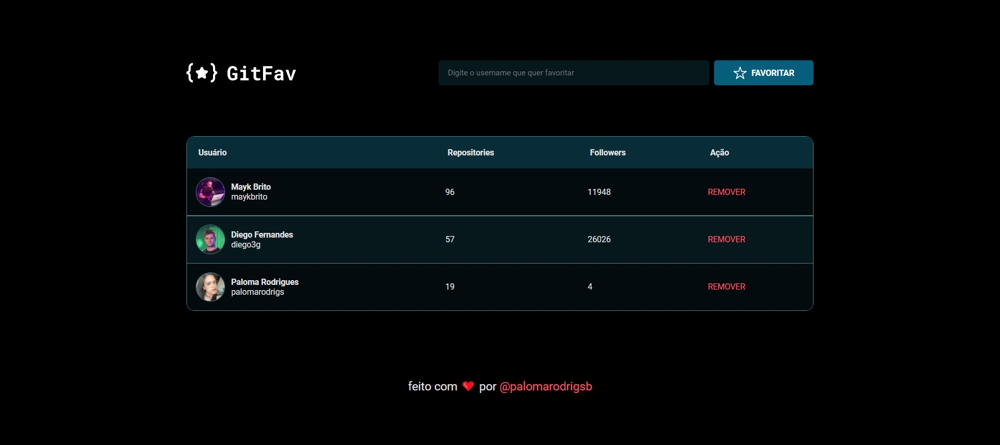
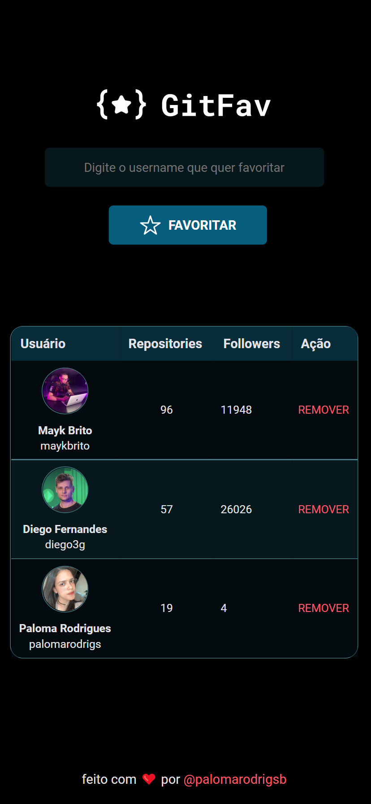

<h1 align="center"> 🐱 Github | Favorites </h1>

Projeto desenvolvido no último desafio do Stage 06 do Explorer, nesse desafio o propósito foi criar uma page responsiva, para favoritar os usuários do Github Favoritos!

 

---

Desktop

  

 Mobile

  

 

# 🔨 Funcionalidades do projeto

`Funcionalidade 1`: Adicionar usúarios do Github na Tabela.

`Funcionalidade 2`: Remover favoritos da tabela.

`Funcionalidade 3`: Deixar a tabela sem nenhum favorito.

 

# 🚀 Tecnologias

As seguintes ferramentas foram usadas na construção do projeto:

 

# 💻 Você pode acessar [aqui](https://github-favorites-mu.vercel.app/)

 feito com ❤ por <a href="https://www.instagram.com/palomarodrigsb" target="_blank">@palomarodrigsb</a>

